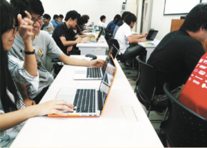

## プログラミング

一般的なプログラミングの授業形式は英語に似ており、文法を学ぶことが中心となるため英語を話す力は後回しになりがちです。これに対して、本コースでは「そもそも実現しようとしている対象は何なのか？」を言葉で説明できるレベルまで理解し、その上でプログラミング言語に翻訳するという過程を重視しています。この過程を頭の中だけの思考として閉じるのではなく、表に出すために「ペア・プログラミング」と呼ばれる手法を導入しました。ペア、つまり二人で作業することになるため、必然的に「今何を考えているのか、やろうとしているのか」を伝え合い、相手の思考を理解しながら共に歩む必要が出てきます。このような授業構成により過程と思考の表現方法を学ぶことで、応用の効く開発能力養成を目指しています。

## プロジェクトデザイン

デザインとは、１％の発想と99％の工夫という労働からなると言われており、どうすればアイデアを発想出来るかということが、非常に重要であり、その人の価値を決定付けます。デザイン演習では、情報産業における様々な課題への最良の解決を導く発想法、戦略立案、意思決定の能力をPBLを通じて養います。それは、ソフトウェアプログラムの設計デザインから知能情報コースのコマーシャル映像制作に至るまで広範囲に及びます。どのようなインターフェイスが使いやすいか。どのように作ればアピール出来るのか。個人のアイデア出しからグループの方針決定までプロジェクトとして運用されます。さらに上級生がプロジェクトマネージャーとして参加することで、管理スキルも学べます。

[知能情報コースYouTubeチャンネル](https://www.youtube.com/channel/UCa1Ds55qqRLKl-QY8F6krjg/feed)ではこの講義を通じて学生が作成したコース紹介動画が搭載されています。

**過去の作品例**

## オペレーティングシステム

Webサービスやスマホなどのソフトを支える技術がオペレーティングシステム(OS)です。様々なサービスやアプリとサーバなどのプログラムと結びつける入り口であるAPIを提供し、これを通じてコンピュータを構成する資源、例えば、メモリ、CPU、ネットワーク、グラフィックなどを管理し操作するのがOSです。OSの最新技術を学べるように教科書は最新の英語の教科書を用います。OSの基本APIを実践的な課題を沢山こなすことにより身につけていきます。これは、今、この時の最新技術を学ぶと言うよりは、これから登場してくる新しい技術を学ぶための方法論になっています。自分のコンピュータあるいはサーバ郡を使いこなす、そのためのソフトウェアを書いていく、新しい技術を積極的に試す、そのための情報を得る方法を知っている。そういうIT技術者を目指す人に役に立つ授業を目指しています。

