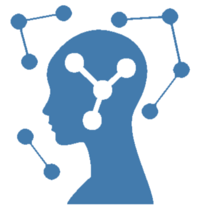
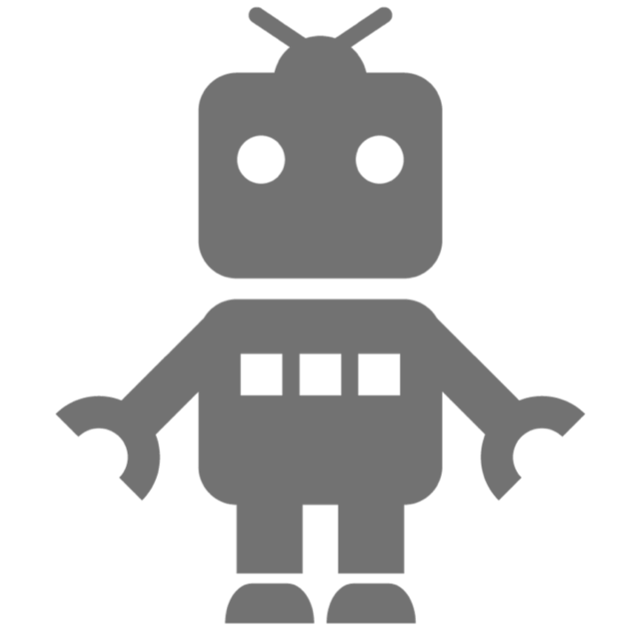

# 理念と目的

論理的思考力と自然科学の知識を基盤として知能情報分野の専門知識・実践力・デザイン能力・解析能力および幅広い教養と技術者倫理・能動的学習能力を修得するとともに、知能情報技術が社会と人間および環境に与える影響と使命を深く理解し、知能・情報・システムの先端技術を通じて国際的視点に立って柔軟かつ自律的に活躍できる技術者を養成します。

## カリキュラムの特色

情報工学科は2017年度より工学科知能情報コースに移行しました。1年次からコンピュータの利用技術を実践的に学ぶ従来の特色を維持しながら、人工知能、データサイエンス、ネットワークセキュリティ、システム開発などの先端技術を身につける講義、演習、実験を新たに設けました。また、工学の専門領域を横断的に学ぶための工学融合科目を設け、幅広い教養を身につける工夫が凝らされています。さらに、国際的に活躍できる人材育成を目指し、4年間を通して、英語を学ぶ講義が用意されています。

## 教員免許

知能情報コースでは、高等学校教員1種免許状(情報)を取得することができます。この場合、教科および教職に関する教科から必要単位を取得する必要があります。また、大学院（博士前期課程）に進学した者で、高等学校教諭1種免許状（情報）を取得している者または1種免許に必要な単位を取得している者は、専修免許を取得することができます。

# 専門性

## 人工知能

近年、自動運転や将棋AI・囲碁AIの活躍など、人工知能が人間に匹敵するほどの成果を見せる事例が数多く挙げられています。人工知能の技術について学ぶことは、近い将来に起こる大きな社会変化の意味を学ぶことかもしれません。  

知能情報コースでは人工知能関連の技術を専門的に学ぶことができます。

## 知能ロボット

知能ロボットはサイバーワールドとリアルワールドを仲介してくれる存在です。実空間の情報を基に、頭脳(コンピュータ)を働かせ、意思・動作決定して実世界に働きかけます。私達の周りでもSiriやPepperなど、姿、形を問わずに様々な知能ロボットが活躍しています。知能情報コースで将来の相棒となる知能ロボットを自ら創造してみませんか？

## IoT -モノのインターネットとセキュリティ-

スマートフォン、PCはもちろん、家電製品、自動車…など現代は世の中のあらゆるモノがインターネットに接続されるようになりました。多種多様なモノがインターネットに繋がり新たな利用価値が生まれた一方で、悪意のあるユーザーの攻撃を防ぐためのセキュリティ対策がより重要になりました。知能情報コースはネットワーク技術はもちろん、情報セキュリティの知識も身につけることができます。

## 無線通信

IoTの世界では、固定されていないほとんどのモノに無線通信技術が必要になります。LTEやWiMAX、衛星通信や近年では海中無線通信など、そこに求められる性能に応じた通信技術が利用されています。知能情報コースでは、無線通信技術の可能性を探求しています。

## データサイエンス

自動運転や将棋AI・囲碁AI、ネットショッピングのおすすめ商品、口腔粘膜による遺伝子検査など、現実社会で起きているこれらのことは、全て大量のデータ(ビッグデータ)から得られた知識が礎となっています。データはただ集めるだけでは役に立たず、正しく解析し、秘められた知識や関係性を見出してはじめて活かせるのです。この研究分野がデータサイエンスです。知能情報コースはデータサイエンス基礎をはじめとした、データサイエンティスト養成のための科目が設けられています。

