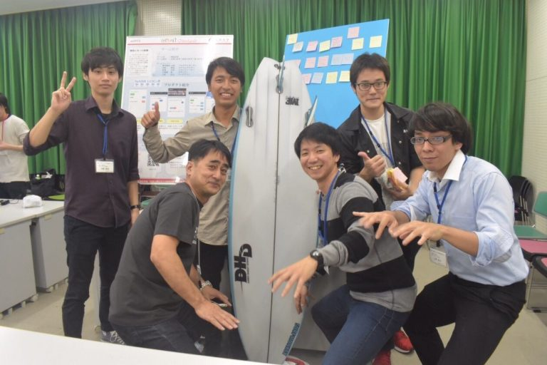
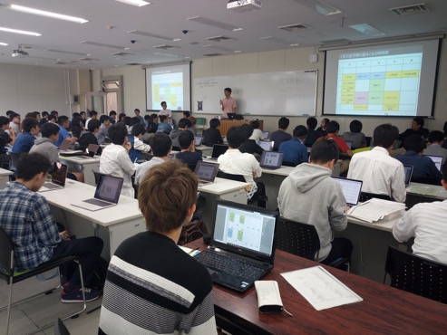

## コース長の挨拶

琉球大学工学部工学科知能情報コースのWEBサイトにアクセス頂きまして、ありがとうございます。  

知能情報コースの長をさせて頂いております遠藤 聡志（えんどう　さとし）です。

IoTシステム構築、ビッグデータ解析、AI、サイバーセキュリティといった知能情報コースの基盤技術が、超スマート社会構築に向けて、今もっとも必要とされています。平成5年に設置された情報工学科は、パソコン、スマートフォン、及びそれらを繋ぐネットワーク（インターネット）の急速な発展とともに改革を続け、最新の社会状況に対応するために努力を続けてきました。平成29年、情報工学科は改組により「知能情報コース」として生まれ変わり、他コースとの連携を強化しつつ、これまでの

**①コンピュータシステム**

**②ロボットや人工知能のようなコンピュータ応用**

**③インターネットに代表される情報通信の3分野**

**④ビッグデータ収集分析等のデータサイエンス**

**⑤サイバー空間の平和を守るネットワークセキュリティの教育・研究**

を充実させ、「アジア太平洋で活躍できるグローバル人材」や「世界的競争力のあるイノベーションを創出できる人材」の育成を新たな目標として掲げています。

## 知能情報コース　沿革

1993年10月1日
情報工学科設置（システム情報工学講座と知能情報工学講座の２大講座）
1997年
インターンシップ（企業における短期研修）の導入
1998年
LSI回路設計に関する学生コンテストの開始
2000年
博士前期課程入試弾力化
2001年
高等学校情報科教員の課程認定の取得
2001年
修士・博士課程学生の海外大学・研究機関への派遣
2005~09年
JABEE（日本技術者教育認定機構）認定
2010~12年
エンジニアリングデザイン教育プロジェクト（カリキュラム改善）を実施
2013~16年
大学院生向けの[enPiT](http://www.enpit.jp/master/)(成長分野を支える情報技術人材の育成拠点の形成)に参加
2016年~
学部生向けの[enPiT](http://www.enpit.jp)を実施
2017年
改組により工学部情報工学科から工学部工学科知能情報コースへ

enPiT BizSysD 2018ワークショップに参加した本学チーム
## 教育上の特色

本コースの教育上の特色は、入学後間もない１年次においてコンピュータの利用技術を実践教育で徹底的に学ばせ、コンピュータを自由自在に駆使する能力を養うと共に、勉学への自覚を培う方針を打ち出しています。  

また、２年次、３年次では、１年次で培ってきた技術を基礎として、コンピュータのハードウェア、ソフトウェアに関する原理や構造、情報システムの基礎技術を学びます。  

さらに、４年次では、各研究室に配属され、指導教員とともに、情報工学分野の基礎及び応用のテーマについて、研究を実施します。  

本コースのもう一つの大きな教育上の特色は、学生個人が問題解決能力を身につけるための実践的講義や、英語教育に重点を置いていることです。そのために、学外より、起業家や専門家を招いた講義や、共通教育の英語科目に加えて、英語力スキルアップのためのコース独自の専門英語科目を開講しています。また、大学院博士前期課程の語学試験（英語）はTOEICやTOEFLを採用しています。

## コース設備

本コースのハードウェアの環境としては、高性能サーバー、PCクラスタ、デスクトップPCなど、ソフトウェア環境としては、各種プログラミング言語、シミュレーションソフトウェア、LSI設計ソフトウェアなどを用意しております。さらに、ネットワーク環境として、学内LAN（有線,無線LAN）を、また、学外への接続に対しては、インターネットはもとより、データ通信回線や衛星通信回線、高速ギガビット回線が構築されております。これらの環境は定期的に更新しており常に時代の先端機器となっています。

## 社会とともに

近年、技術の社会的影響がますます高まると共に、また企業活動のグローバル化に伴い、国際的に通用する技術者教育が非常に重大な課題になってきております。このため、高等教育機関における技術者教育に対する評価の必要性から、1999年11月に日本技術者教育認定機構(Japan Accreditation Board for Engineering Education: JABEE)が発足しました。これは、大学学部および高等専門学校専攻科レベルの教育を対象として、工学教育を中心とした技術者教育プログラムの認定を行い、その国際的な同等性を確保すると共に、質の向上を目的としています。本コースは2005年にJABEEの認定を受けましたが、これは全国の情報系学科の中でもかなり早い時期での認定となりました。その後2009年度をもってJABEE認定を中断し、ゆとり教育対応の数学講義強化、グループワークおよびエンジニアリングデザイン教育強化のためカリキュラムを改訂し、琉球大学URGCC（UNIVERSITY OF THE RYUKYUS Global Citizen Curriculum）対応の教育を実施しています。特に、実践的で社会で即戦力になれるエンジニアを養成するために、新しいカリキュラムの開発にも積極的に取り組んでいます。2010年度～2013年度にエンジニアデザイン教育プロジェクトを立ち上げ、課題解決能力養成のための実践的な授業を導入する等、カリキュラムを改良しました。現在は、教育方法、評価方法の改善に取り組んでいます。

以上のように、知能情報コースは常に新しい改革を求めて教育・研究活動に取り組んでおります。このような教育環境の中で、本コース卒業生が、国内のみならず、広く世界の企業や教育・研究機関、及び官界で活躍することを期待しています。

