  

## 教員

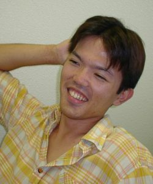
### 赤嶺 有平

Akamine Yuhei

職名
助教
専門分野

 複雑系工学  

 並列計算  

 セルオートマトン  

 マルチエージェント
E-mail

[yuhei@ie.u-ryukyu.ac.jp](mailto:yuhei@ie.u-ryukyu.ac.jp)

HP

[AKAMINE KEN NO HP](http://assam.tea.ie.u-ryukyu.ac.jp/)

### 遠藤 聡志

Endo Satoshi

職名
教授(コース長)
専門分野

 複雑系工学  

 マルチエージェント  

 進化的計算  

 機械学習
E-mail

[endo@ie.u-ryukyu.ac.jp](mailto:endo@ie.u-ryukyu.ac.jp)

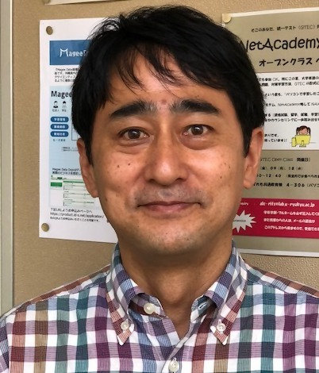
### 岡崎 威生

Okazaki Takeo

職名
教授
専門分野

 潜在構造モデル  

 推測過程論  

 ヒトゲノム情報
E-mail

[okazaki@ie.u-ryukyu.ac.jp](mailto:okazaki@ie.u-ryukyu.ac.jp)

HP

[Okazaki’s Home Page](http://www.ms.ie.u-ryukyu.ac.jp/~okazaki/)

### 姜 東植

Kang Dongshik

職名
准教授
専門分野

 知的情報処理  

 地理情報システム
E-mail

[kang@ie.u-ryukyu.ac.jp](mailto:kang@ie.u-ryukyu.ac.jp)

HP

[知的制御工学研究室 – 宮城・姜研 WEB](http://iis.ie.u-ryukyu.ac.jp/)

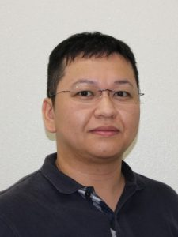
### 國田 樹

Kunita Itsuki

職名
助教
専門分野

 複雑系科学  

 細胞運動のメカニクス  

 生物適応能  

 生体情報処理
E-mail

[kunita@ie.u-ryukyu.ac.jp](mailto:kunita@ie.u-ryukyu.ac.jp)

HP

[Kunita Lab. |
 情報技術で生き物を知る。](/kunita/)

### 河野 真治

Kono Shinji

職名
准教授
専門分野

 並列オブジェクト指向言語  

 持続型オブジェクト
E-mail

[kono@ie.u-ryukyu.ac.jp](mailto:kono@ie.u-ryukyu.ac.jp)

HP

[Shinji Kono’s Page](http://www.ie.u-ryukyu.ac.jp/~kono/)

### 玉城 史朗

Tamaki Shiro

職名
教授
専門分野

 制御・システム工学
E-mail

[shiro@ie.u-ryukyu.ac.jp](mailto:shiro@ie.u-ryukyu.ac.jp)

### 玉城 絵美

Tamaki Emi

職名
教授
専門分野

 HCI(Human Computer Interaction)
E-mail

[emi@ie.u-ryukyu.ac.jp](mailto:emi@ie.u-ryukyu.ac.jp)

HP

[researchmap](https://researchmap.jp/hoimei/)

### 當間 愛晃

Toma Naruaki

職名
准教授
専門分野

 複雑系工学  

 人工知能
E-mail

[tnal@ie.u-ryukyu.ac.jp](mailto:tnal@ie.u-ryukyu.ac.jp)

HP

[NAL研（仮）](/~tnal/)

### 名嘉村 盛和

Nakamura Morikazu

職名
教授
専門分野

 並列分散アルゴリズム  

 ペトリネット
E-mail

[morikazu@ie.u-ryukyu.ac.jp](mailto:morikazu@ie.u-ryukyu.ac.jp)

HP

[Morikazu
 Nakamura’s Page – Smile lots it costs nothing!](/morikazu/)

### 長田 智和

Nagata Tomokazu

職名
准教授
専門分野

 ネットワーク
E-mail

[nagayan@ie.u-ryukyu.ac.jp](mailto:nagayan@ie.u-ryukyu.ac.jp)

HP

[Tomokazu
 NAGATA](http://n-lab.info/)

### 長山 格

Nagayama Itaru

職名
准教授
専門分野

 マルチメディア情報処理  

 適応信号処理システム信頼性工学
E-mail

[nagayama@ie.u-ryukyu.ac.jp](mailto:nagayama@ie.u-ryukyu.ac.jp)

HP

[琉球大学-長山研](/nagayama-laboratory/)

### 宮里 智樹

Miyazato Tomoki

職名
助教
専門分野

 ネットワーク制御・モデリング
E-mail

[tmiyazato@ie.u-ryukyu.ac.jp](mailto:tmiyazato@ie.u-ryukyu.ac.jp)

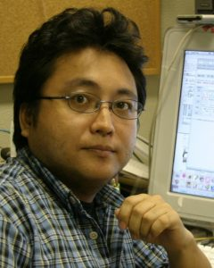
### 山田 孝治

Yamada Koji

職名
教授
専門分野

 複雑系工学  

 知能ロボット  

 分散人工知能
E-mail

[koji@ie.u-ryukyu.ac.jp](mailto:koji@ie.u-ryukyu.ac.jp)

HP

[Koji Yamada
 Wiki](/~koji/pw/)

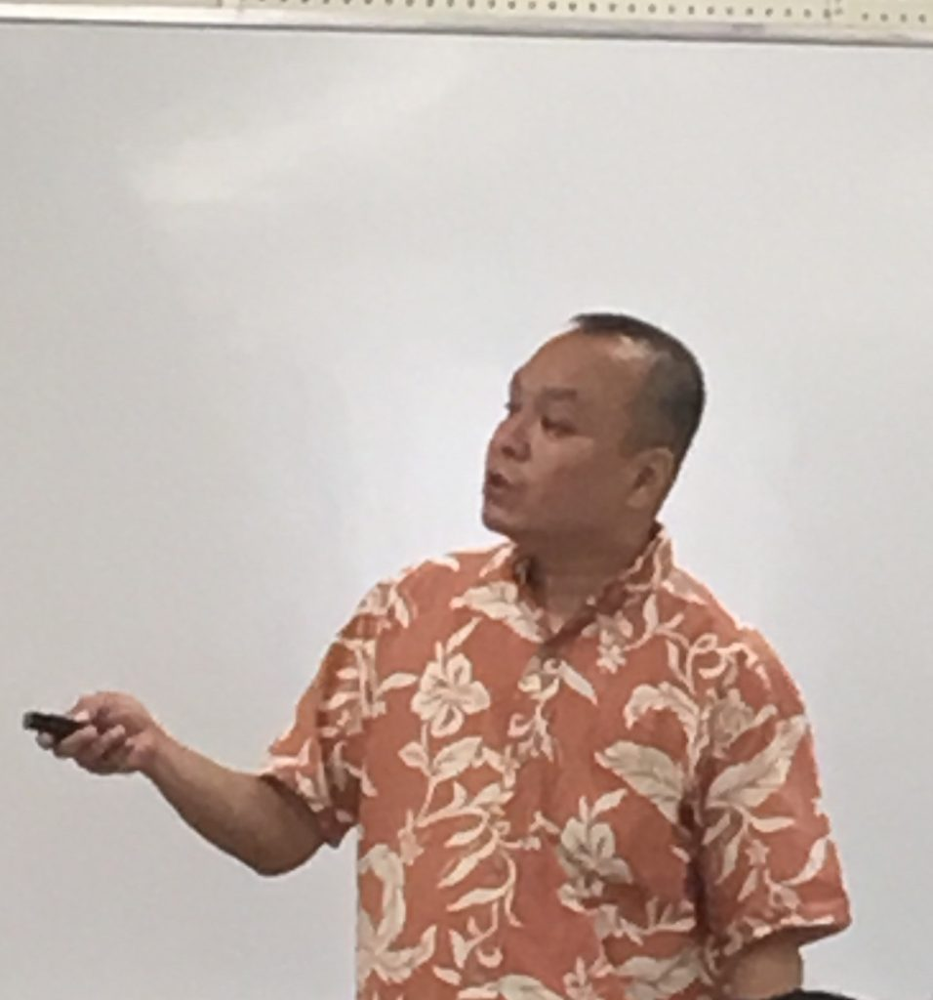
### 吉田 たけお

Yoshida Takeo

職名
助教
専門分野

 ハードウェア記述言語  

 ディジタルシステムの耐故障化設計
E-mail

[tyoshida@ie.u-ryukyu.ac.jp](mailto:tyoshida@ie.u-ryukyu.ac.jp)

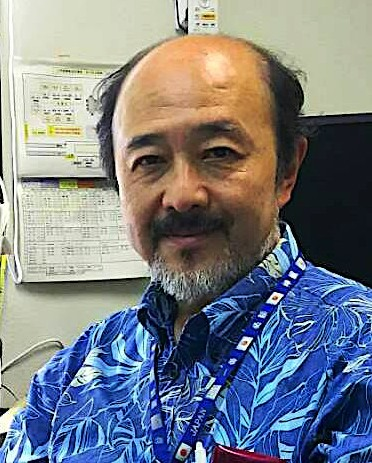
### 和田 知久

Wada Tomohisa

職名
教授(学部長)
専門分野

 ディジタルシステム設計  

 大規模システム LSI (SOC) 設計
E-mail

[wada@ie.u-ryukyu.ac.jp](mailto:wada@ie.u-ryukyu.ac.jp)

HP

[Tom Wada’s Home Page](http://www.ie.u-ryukyu.ac.jp/~wada/)

## 技術・事務職員

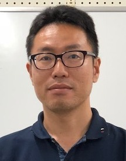
### 名嘉 秀和

Naka Hidekazu

職名
技術
専門分野

 実験補助  

 補講担当  

 並列分散アルゴリズム
E-mail

[nakarx@ie.u-ryukyu.ac.jp](mailto:nakarx@ie.u-ryukyu.ac.jp)

HP

[About Me](/~nakarx/)

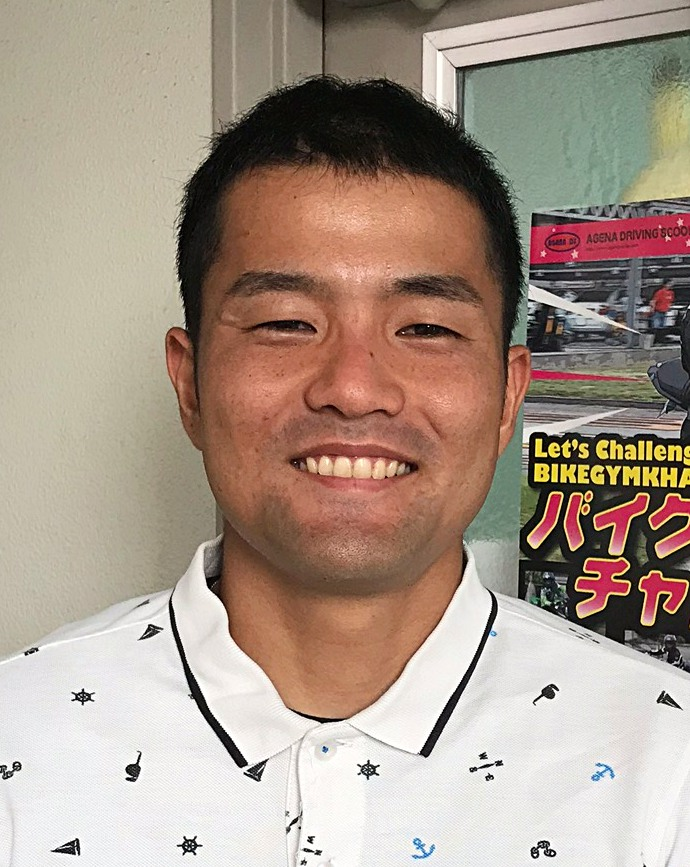
### 翁長 竜盛

Onaga Tatsumori

職名
技術
専門分野

 実験補助  

 学科補助
E-mail

[tattsu@ie.u-ryukyu.ac.jp](mailto:tattsu@ie.u-ryukyu.ac.jp)

HP

[WELCOME](/~tattsu/)

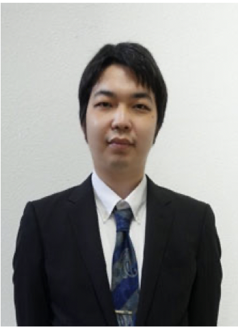
### 小林 夏樹

Kobayashi Natsuki

職名
技術
専門分野

 実験補助  

 学科補助
E-mail

[koba@ie.u-ryukyu.ac.jp](mailto:koba@ie.u-ryukyu.ac.jp)

HP

[Koba blog](/koba/)

### 新城 弥生

Shinjo Yayoi

職名
事務
E-mail

[yayoi@ie.u-ryukyu.ac.jp](mailto:yayoi@ie.u-ryukyu.ac.jp)

### 米須 順子

Yonesu Junko

職名
事務
E-mail

[junkoy@ie.u-ryukyu.ac.jp](mailto:junkoy@ie.u-ryukyu.ac.jp)

## 名誉教授

### 喜屋武 盛基

Kyan Seiki

### 翁長 健治

Onaga Kenji

E-mail

[onaga@ie.u-ryukyu.ac.jp](mailto:onaga@ie.u-ryukyu.ac.jp)

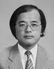
### 宮城 隼夫

Miyagi Hayao

E-mail

[miyagi@ie.u-ryukyu.ac.jp](mailto:miyagi@ie.u-ryukyu.ac.jp)

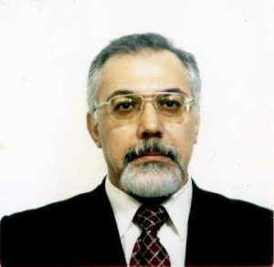
### Mohammad Reza Asharif

E-mail

[asharif@ie.u-ryukyu.ac.jp](mailto:asharif@ie.u-ryukyu.ac.jp)

HP

[Department of Electromagnetic Systems](/~asharif/)

### 高良 富夫

Takara Tomio

E-mail

[takara@ie.u-ryukyu.ac.jp](mailto:takara@ie.u-ryukyu.ac.jp)

